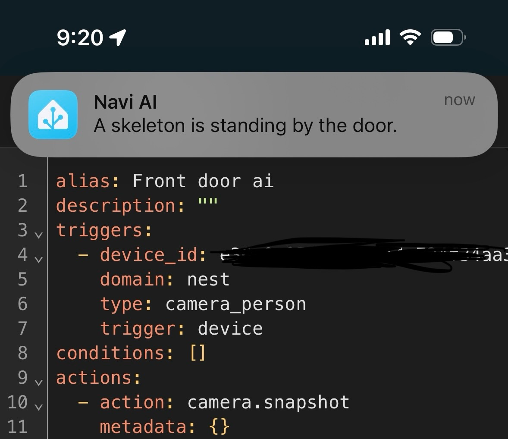
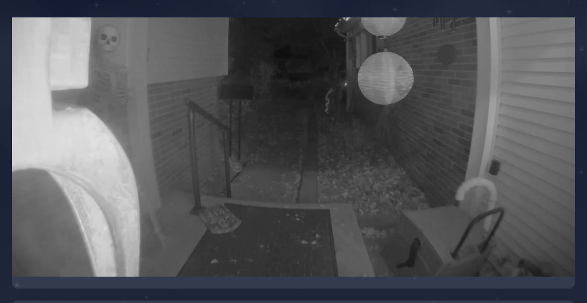

# Summary
An automation that sends a camera snapshot to google generative ai for a summary and sends that summary via the mobile app as a notification

# Prereq
* A camera with person detection. Nest Hello in my case
* A [Google Genrative AI API](https://aistudio.google.com/app/apikey) key. I'm using free tier. 
* The [Google Generative AI Home Assistant Integration](https://www.home-assistant.io/integrations/google_generative_ai_conversation/)

# Screenshot

